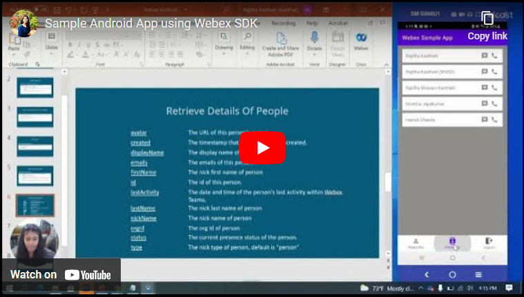

<!-- # Repo-Template
This is an Internal WXSD Template to be used for GitHub Repos moving forward. Follow the following steps: Visit https://github.com/wxsd-sales/readme-template/blob/master/README.md for extended details.
-->


<!--   Step 1) Name your repository: Names will ALWAYS start with "bot - ", "integration -", "macro -", or "supportapp -" 
Examples:"bot- <insert repo name>" 
       "integration - <insert repo name>"
       "macro - <insert repo name>"
       "supportapp - <insert repo name>" 

~3 words, kebab case, use words to indicate what it does. Visit https://github.com/wxsd-sales/readme-template/blob/master/README.md for details  
-->

<!--  Step 2) Add One sentence description to your repository: Copy/Paste from Webex Labs Card sentence.
       Example: "Redirect an Auto Attendant caller to an SMS conversation to alleviate Call Queue Agent responsibilities."
-->

<!--  Step 3) Use following Template to copy/paste your details below -->

# Android SDK Demo App
 Welcome to our WXSD DEMO Repo! <!-- Keep this here --> 
 
This demo provides an introduction on how to begin building Android applications with meetings, messaging and other basic features, using the Webex Android SDK.

In this application, we use the SDK to retrieve details about the logged in user, extract all the direct contacts of that user, and use messaging and meeting features to engage with their contacts. This application also demonstrates how to add meeting controls like muting the audio, muting the video, screen sharing, speaker mode, holding the call etc. You can also login and logout of the app using OAuth webview.  

[](https://www.youtube.com/watch?v=TQJMAFmR8eQ&t=16s, "Android SDK Demo App")

<!-- Keep the following here -->  
 *_Everything included is for demo and Proof of Concept purposes only. Your use of the site is solely at your own risk. This site may contain links to third party content, which we do not warrant, endorse, or assume liability for. These demos are for Cisco Webex usecases, but are not Official Cisco Webex Branded demos._

## Table of Contents
<!-- ⛔️ MD-MAGIC-EXAMPLE:START (TOC:collapse=true&collapseText=Click to expand) -->
<details>
<summary>(click to expand)</summary>
    
  * [Setup](#setup)
  * [Demo](#demo)
  * [License](#license)  
  * [Support](#support)

</details>
<!-- ⛔️ MD-MAGIC-EXAMPLE:END -->


## Setup

### Prerequisites: The following instructions assume that you have:

- Mobile Integration with valid client ID and client secret. Please refer [Webex Developer Site](https://developer.webex.com/docs/integrations#registering-your-integration) to see how to register your integration.


<!-- GETTING STARTED -->

### Installation Steps:
1.  Download or clone this git project and open it in your android studio IDE
2.  Include all these constants in your gradle.properties file
    ```
    CLIENT_ID=""
    CLIENT_SECRET=""
    SCOPE=""
    REDIRECT_URI=""
    ```
3.  Run this project on android emulator or on local device
    
    
## Live Demo

<!-- Insert link to the website below (if deployed) and/or to the YouTube/Vidcast video. -->

Check out our live demo, available [here](<https://www.youtube.com/watch?v=TQJMAFmR8eQ&t=16s>)!

<!-- Keep the following statement -->
*For more demos & PoCs like this, check out our [Webex Labs site](https://collabtoolbox.cisco.com/webex-labs).

## License

Include a one liner here. Point to the `LICENSE` file in the repository.


## Support

Please contact the WXSD team at [wxsd@external.cisco.com](mailto:wxsd@external.cisco.com?subject=RepoName) for questions. Or for Cisco internal, reach out to us on Webex App via our bot globalexpert@webex.bot & choose "Engagement Type: API/SDK Proof of Concept Integration Development". 
